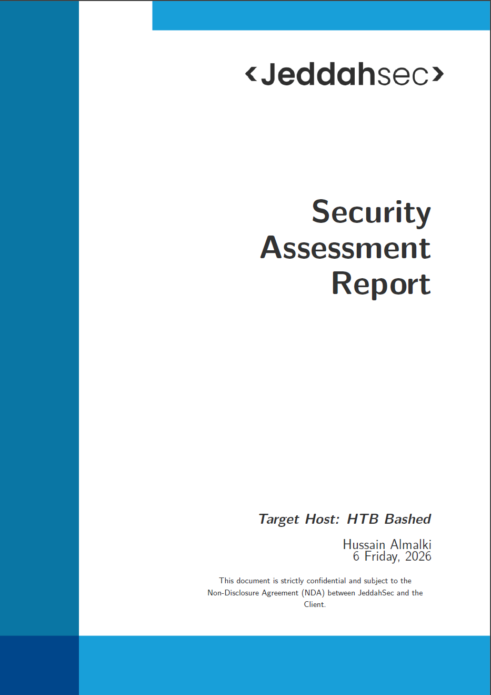
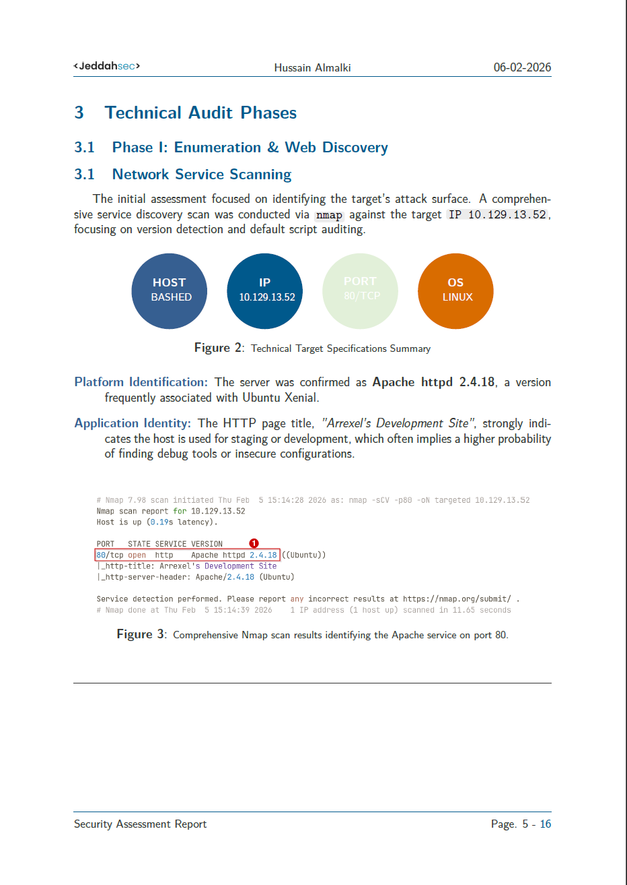
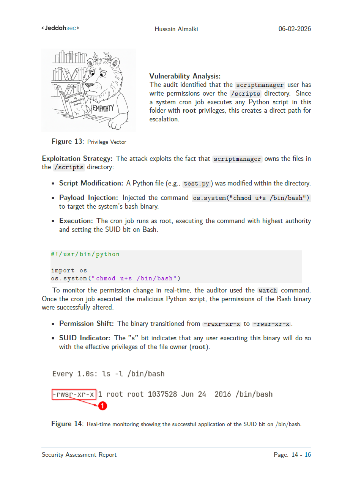

# 📄 قالب تقرير اختبار اختراق احترافي بلغة LaTeX 
### Professional Penetration Testing Report Template (HTB: Bashed)

---

## 🌟 نبذة عن المشروع
هذا المشروع يقدم قالب LaTeX متكامل ومخصص لكتابة تقارير الأمن السيبراني واختبار الاختراق بشكل احترافي. تم تصميم القالب ليكون سهل التعديل ومنظماً بما يتناسب مع المعايير التقنية العالمية، مع التركيز على الجانب البصري لتسهيل فهم الثغرات ومراحل الاختراق.

---

## ✨ المميزات الرئيسية
* **تصميم عصري وجذاب:** واجهات نظيفة وتنسيق أكاديمي احترافي.
* **صناديق أوامر (Terminal Boxes):** تمييز الأوامر البرمجية بصناديق تحاكي شاشة الكونسول الحقيقية.
* **دوائر المعلومات التقنية:** عرض بيانات الهدف (IP, OS, Ports) بشكل بصري أنيق باستخدام `TikZ`.
* **هيكل تقرير متكامل:** يبدأ من بيان السرية (NDA) وحتى التوصيات النهائية (Remediation).
* **توافق كامل:** يعمل بسلاسة على منصات مثل **Overleaf**.

---

## 📸 معاينة التقرير (Screenshots)


 
---

## 🛠️ المتطلبات التشغيلية
لضمان عمل القالب دون أخطاء، تأكد من تفعيل الحزم التالية في بيئة LaTeX الخاصة بك:
- `tcolorbox` (مع تفعيل خيار `most`)
- `tikz` و `usetikzlibrary{arrows.meta, positioning, shadows}`
- `graphicx` للصور.
- `hyperref` للروابط التفاعلية وفهرس المحتويات.

---

## 🤝 المساهمة

المشروع مفتوح للمساهمة! إذا كان لديك اقتراحات لتحسين الألوان، الخطوط، أو إضافة أقسام جديدة، يسعدني استقبال الـ **Pull Requests**.

---

## 🛡️ إخلاء مسؤولية

هذا العمل مخصص للأغراض التعليمية ومساعدة المهتمين بمجال الأمن السيبراني على توثيق أعمالهم. لا يتحمل صاحب المشروع أي مسؤولية عن سوء استخدام المعلومات الواردة في القالب.

---

## 📂 هيكل المجلدات
```text
├── template_Article.tex   # الكود المصدري الأساسي للتقرير
├── Figuras/               # مجلد الصور التوضيحية وشعار المشروع
└── README.md              # شرح المشروع (هذا الملف)
````

---
## 👨‍💻 إعداد وتطوير

**Hussain Almalki**

- [GitHub](https://github.com/JeddahSec)

